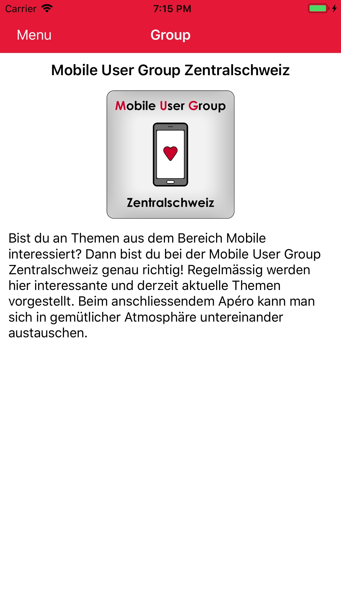
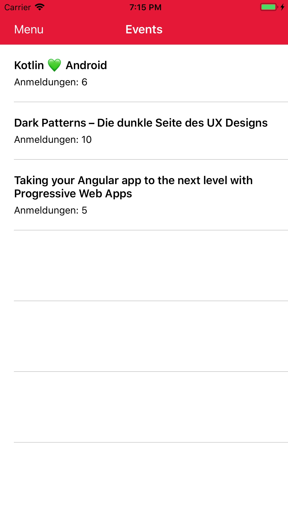
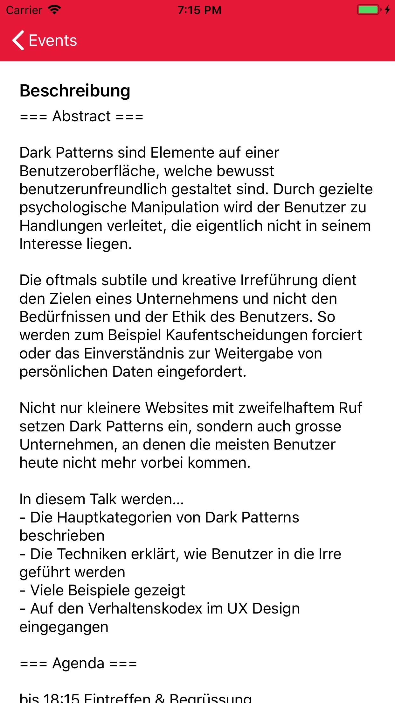

# MobLab 2019: Fastlane

This repository contains the source code examples for the [Fastlane](https://fastlane.tools)-report written by [Thomas Kälin](mailto:thomas.kaelin@hslu.ch) in 08/2019.

# Demo-App

For demonstrating the usefulness of Fastlane, a simple [Xamarin](https://dotnet.microsoft.com/apps/xamarin)-App for Android and iOS has been implemented. The app retrieves different information about the *[Mobile User Group Zentralschweiz](https://www.meetup.com/de-DE/Mobile-User-Group-Zentralschweiz/)* from Meetup.com and displays them inside the app.

  
  
  

The following folders contain the source- and test-code for the app:

* `MUG_App.Share`
* `MUG_App.Test.Integration`
* `MUG_App.UI.Forms`
* `MUG_App.UI.Android`
* `MUG_App.UI.iOS`
* `MUG_App.Test.Unit`
* `MUG_App.Test.Integration`

To start editing the code, simply open `MUG_App.sln` in [Visual Studio 2019](https://visualstudio.microsoft.com/vs/).

# Fastlane

Nearly all the actions around building and deploying the apps have been automated. Have a look at the auto-generated [fastlane/README.md](fastlane/README.md) from Fastlane for further details about all the available lanes.

If you need help installing Fastlane on your machine, please follow the installation-guidelines on the [official website](https://docs.fastlane.tools/).

## Credentials

Many of the lanes do need sensitive information, such as passwords or API-tokens. Because of security-reasons, those values should never be checked into the repository.

For configuring those values, a (git-ignored) file `fastlane/.env.secret` has to be added in your working copy. Use `fastlane/.env` as a template and fill all the empty values accordingly.
